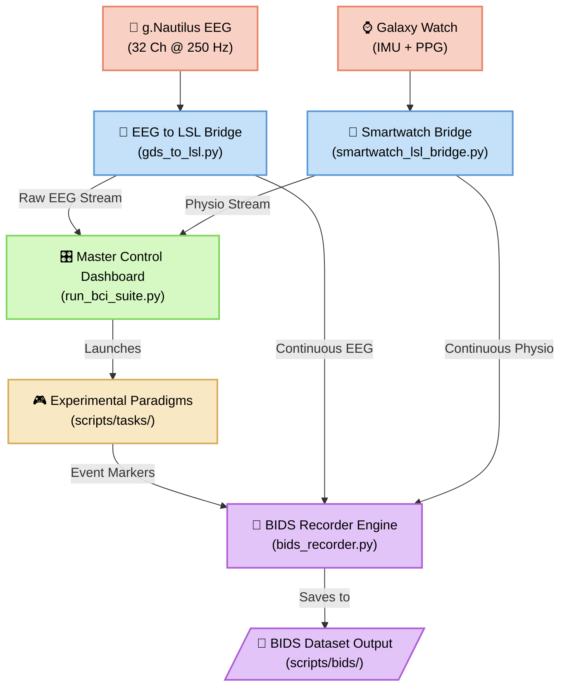
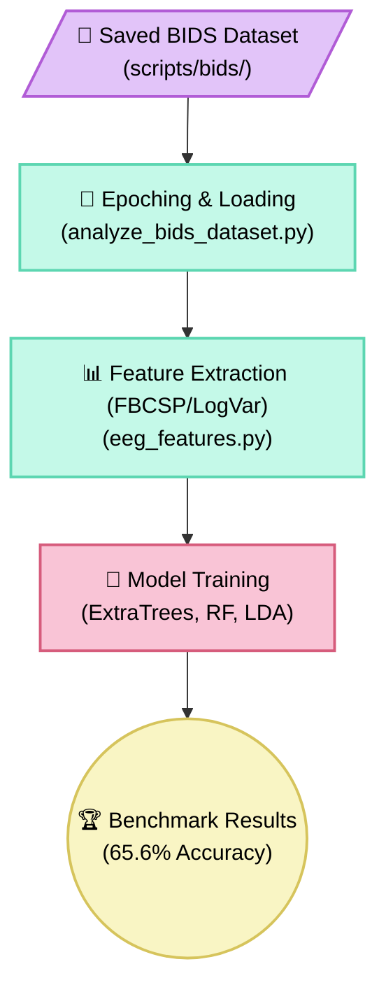

# Nautilus BCI: End-to-End Brain-Computer Interface Suite

[](https://www.python.org/)
[](LICENSE)

Welcome to the **Nautilus BCI** project. This is a comprehensive Python suite for streaming 32 channels of EEG data from the g.Nautilus BCI headset (`NP-2026.05.01`), synchronizing physiological data from smartwatches, running experimental task paradigms, and performing offline Machine Learning decoding on BIDS datasets.

---

## 📖 Documentation & Guides

- [Beginner's Guide & System Architecture](docs/getting_started_bci_guide.md)
- [BIDS Dataset Standard & Usage](docs/bids_standard_and_usage.md)
- [BCI Signal Processing Theory](docs/bci_signal_processing.md)
- [Scripts Directory README](scripts/README.md)

---

## ⚡ Core Features

- **Real-Time Streaming**: Native C++ API bridging to LSL for g.Nautilus EEG and UDP-to-LSL for Galaxy Watch IMU/PPG.
- **Multimodal BIDS Recording**: Automatically synchronizes and saves continuous signals and event markers into the standardized Brain Imaging Data Structure (BIDS).
- **Master Dashboard**: A single PySide6 GUI (`run_bci_suite.py`) to manage hardware, visualize 30FPS brain rhythms, start recordings, and launch tasks.
- **Experimental Paradigms**:
  - *Motor Imagery*: 4-Direction tasks for sensorimotor rhythm training.
  - *Auditory Recall*: 6-Track music memory tasks and full continuous track listening.
- **Machine Learning**: End-to-end extraction of Filter Bank Common Spatial Patterns (FBCSP) and Classification (ExtraTrees, RF, LDA) yielding benchmark accuracies > 65% on 4-class MI.

---

## 🚀 Quick Start

To launch the Master Control Panel (ensure you are using `uv` for dependency management):

```powershell
cd scripts
uv run python run_bci_suite.py
```

From the control panel, you can start the EEG streamer, observe the live signal scope, start BIDS recording, and launch any of the task paradigms.

---

## 🏗️ System Architecture & Interactive Pipelines

*Click on any node in the graphs below to navigate directly to the relevant source code or directory!*

### 1. Real-Time Data Collection Pipeline



### 2. Data Analysis & Machine Learning Pipeline


