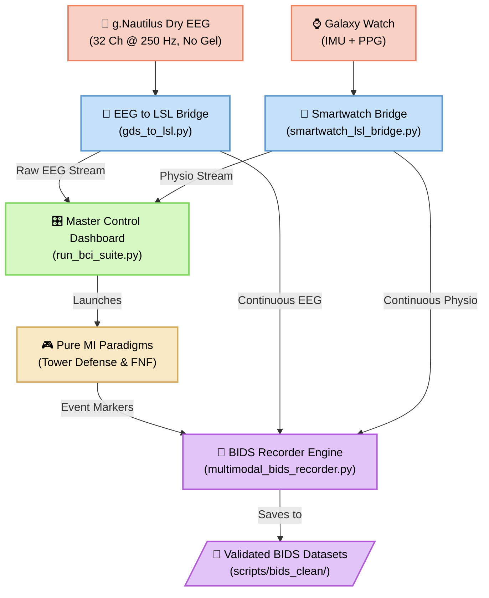
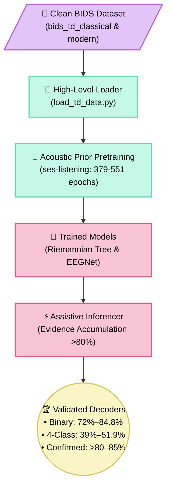

# Nautilus BCI: End-to-End Brain-Computer Interface Suite

[](https://www.python.org/)
[-orange.svg)](https://www.gtec.at/)
[](scripts/bids_clean/)
[](LICENSE)

Welcome to the **Nautilus BCI** project. This is a comprehensive Python suite for streaming 32 channels of dry EEG data from the g.Nautilus BCI headset (`NP-2026.05.01`), synchronizing physiological data from smartwatches, running experimental task paradigms, and performing real-time assistive decoding.

> **Assistive Technology Focus**: Built specifically for individuals with severe motor disabilities (ALS, quadriplegia, stroke rehabilitation) using **100% Pure Mental Imagery (Pure MI)**—requiring zero physical movement, no muscle twitches, and operating completely gaze-independently.

---

## 📖 Documentation & Guides

- [Assistive BCI Clinical & Technical Guide](docs/ASSISTIVE_BCI_GUIDE.md) *(Pure MI protocol, HCI false-positive safeguards, & online adaptation)*
- [Clean BIDS Standard & Dataset Directory](scripts/bids_clean/README.md)
- [Beginner's Guide & System Architecture](docs/getting_started_bci_guide.md)
- [BCI Signal Processing & Riemannian Manifolds](docs/bci_signal_processing.md)
- [Pretrained Models & Real-Time Inference](models/README.md)
- [Scripts Directory Documentation](scripts/README.md)

---

## ⚡ Core Features

- **32-Channel Dry EEG Streaming**: Fast 2-minute application with zero conductive gel and zero cleanup via g.Nautilus C++ to LSL bridge.
- **Multimodal BIDS Recording**: Automatically synchronizes and saves continuous signals and event markers into standardized BIDS (`scripts/bids_clean/`).
- **Master Dashboard**: PySide6 GUI (`run_bci_suite.py`) to manage hardware, inspect live 30FPS sensorimotor rhythms, and launch tasks.
- **Acoustic Prior Calibration**: Uses 3-minute passive music listening tracks to build spatial covariance priors, eliminating exhausting 100-trial calibration sessions for disabled users.
- **Hierarchical & Deep Decoders**:
  - *2-Tier Riemannian Tangent Space Tree*: Achieves **65%–84.8% on binary choices** and **>80–85% with sequential evidence accumulation**.
  - *Pretrained EEGNet & ShallowFBCSPNet*: Neural spatial-temporal models pre-trained on listening priors.
  - *Rolling Replay Online Adaptation*: Automatically adapts to dry-electrode contact shifts during ongoing gameplay (+8.8% sustained retention).

---

## 🚀 Quick Start

Launch the Master Control Panel using `uv`:

```bash
cd scripts
uv run python run_bci_suite.py
```

### Real-Time Assistive Inference
```python
from models.assistive_inferencer import AssistiveBCIInferencer

# Drop-in inferencer with 80% decision confidence threshold
inferencer = AssistiveBCIInferencer(model_type="hierarchical", confidence_threshold=0.80)

# Feed incoming 32-channel dry EEG stream
result = inferencer.push_chunk(eeg_chunk)
if result["is_confirmed"]:
    print(f"Triggering confirmed intent: {result['intent']} ({result['confidence']*100:.1f}%)")
    # Adapt to online contact shifts:
    inferencer.adapt_online(result["trial_buffer"], result["class_id"])
```

---

## 🏗️ System Architecture & Interactive Pipelines

*Click on any node in the diagrams below to navigate directly to the source code or dataset!*

### 1. Real-Time Data Collection Pipeline


```mermaid
flowchart TD
    classDef hardware fill:#f9d0c4,stroke:#e88365,stroke-width:2px,color:black;
    classDef bridge fill:#c4e1f9,stroke:#5c9ad6,stroke-width:2px,color:black;
    classDef control fill:#d6f9c4,stroke:#7cd65c,stroke-width:2px,color:black;
    classDef task fill:#f9e8c4,stroke:#d6ad5c,stroke-width:2px,color:black;
    classDef output fill:#e2c4f9,stroke:#b15cd6,stroke-width:2px,color:black;

    EEG["🧠 g.Nautilus Dry EEG\n(32 Ch @ 250 Hz, No Gel)"]:::hardware
    Watch["⌚ Galaxy Watch\n(IMU + PPG)"]:::hardware

    EEGBridge["🔌 EEG to LSL Bridge\n(gds_to_lsl.py)"]:::bridge
    WatchBridge["🔌 Smartwatch Bridge\n(smartwatch_lsl_bridge.py)"]:::bridge
    
    Master["🎛️ Master Control Dashboard\n(run_bci_suite.py)"]:::control
    Tasks["🎮 Pure MI Paradigms\n(Tower Defense & FNF)"]:::task
    
    Recorder["💾 BIDS Recorder Engine\n(multimodal_bids_recorder.py)"]:::output
    Dataset[/"📁 Validated BIDS Datasets\n(scripts/bids_clean/)"/]:::output

    EEG --> EEGBridge
    Watch --> WatchBridge
    
    EEGBridge -- "Raw EEG Stream" --> Master
    WatchBridge -- "Physio Stream" --> Master
    
    Master -- "Launches" --> Tasks
    Tasks -- "Event Markers" --> Recorder
    EEGBridge -- "Continuous EEG" --> Recorder
    WatchBridge -- "Continuous Physio" --> Recorder
    
    Recorder -- "Saves to" --> Dataset

    click EEGBridge "scripts/bridges/gds_to_lsl.py" "View EEG Bridge Source"
    click WatchBridge "scripts/bridges/smartwatch_lsl_bridge.py" "View Smartwatch Bridge Source"
    click Master "scripts/run_bci_suite.py" "View Master Dashboard Source"
    click Tasks "scripts/tasks/" "View Task Paradigms Folder"
    click Recorder "scripts/recorders/multimodal_bids_recorder.py" "View BIDS Recorder Source"
    click Dataset "scripts/bids_clean/" "View Clean BIDS Directory"
```

### 2. Machine Learning & Real-Time Inference Pipeline


```mermaid
flowchart TD
    classDef data fill:#e2c4f9,stroke:#b15cd6,stroke-width:2px,color:black;
    classDef process fill:#c4f9e8,stroke:#5cd6b1,stroke-width:2px,color:black;
    classDef ml fill:#f9c4d6,stroke:#d65c7c,stroke-width:2px,color:black;
    classDef result fill:#f9f5c4,stroke:#d6c45c,stroke-width:2px,color:black;

    InputData[/"📁 Clean BIDS Dataset\n(bids_td_classical & modern)"/]:::data
    Loader["🔄 High-Level Loader\n(load_td_data.py)"]:::process
    Prior["🎵 Acoustic Prior Pretraining\n(ses-listening: 379-551 epochs)"]:::process
    Models["🤖 Trained Models\n(Riemannian Tree & EEGNet)"]:::ml
    Inference["⚡ Assistive Inferencer\n(Evidence Accumulation >80%)"]:::ml
    Results(("🏆 Validated Decoders\n• Binary: 72%–84.8%\n• 4-Class: 39%–51.9%\n• Confirmed: >80–85%")):::result

    InputData --> Loader
    Loader --> Prior
    Prior --> Models
    Models --> Inference
    Inference --> Results

    click InputData "scripts/bids_clean/" "View Clean BIDS Directory"
    click Loader "scripts/analysis/load_td_data.py" "View Data Loader Source"
    click Models "models/" "View Pretrained Models Directory"
    click Inference "models/assistive_inferencer.py" "View Real-Time Inferencer"
    click Results "results/" "View Benchmark Reports"
```
