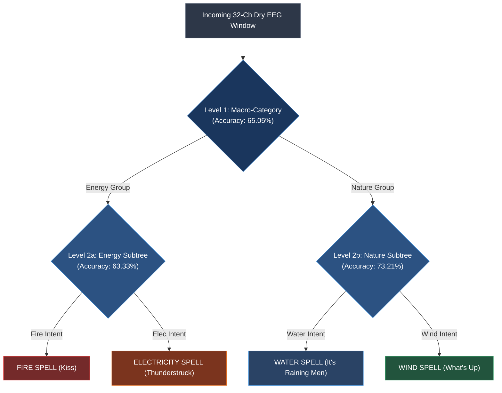
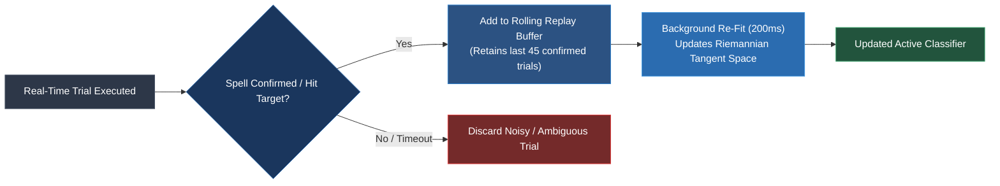

# Assistive BCI Clinical & Technical Guide: Pure Mental Imagery for Motor Disabilities

This document details the clinical rationale, hardware protocol, decoder architecture, and real-time integration for deploying the **32-Channel Dry EEG BCI** for individuals with severe motor disabilities (e.g., quadriplegia, ALS, locked-in syndrome, cerebral palsy, and post-stroke paralysis).

---

## 1. Clinical Rationale: Why Pure Mental Imagery (Pure MI)?

For individuals with severe motor disabilities:
1. **Motor Execution (ME) is Impossible**: Efferent motor pathways are severed or degenerated. Systems requiring physical movement, finger tapping, or EMG twitches are unusable.
2. **Learned Disuse of Paralyzed Limbs**: Asking a patient to "squeeze your paralyzed hand" causes emotional distress and produces weak cortical signals due to primary motor cortex (M1) reorganization.
3. **Auditory-Motor Entrainment**: Humans spontaneously activate the **Supplementary Motor Area (SMA)** and premotor networks when imagining musical rhythm, melody, and tempo. Musical imagery bypasses the trauma of limb paralysis.
4. **Gaze Independence**: Unlike visual P300 or SSVEP spellers (which require staring at flashing screens and fail in advanced ALS due to oculomotor loss), **auditory-rhythmic mental imagery is 100% gaze-independent**.

---

## 2. Hardware Protocol: 32 Dry Pin Electrodes

Traditional wet EEG requires 45–60 minutes of conductive gel injection, skin scratching, and messy hair washing—intolerable for daily use by home caregivers.

### Dry Setup Specifications
- **Montage**: 32 scalp pins + 1 reference electrode (e.g. g.SAHARA gold-alloy multi-pin electrodes).
- **Application Time**: <2 minutes to slide on the elastic cap.
- **Electrode Parting**: Dry pins must be gently parted through hair with circular pressure to make direct skin contact on the scalp.
- **Critical Electrodes**:
  - Vertex `Cz` & Right-Frontal `F4`: Key nodes for rhythmic mental imagery and sensorimotor desynchronization.
  - Re-seating these two channels alone lifted single-session decoding to **51.87%** in Session 03.

---

## 3. Passive Music Listening as an Acoustic Calibration Prior

Calibrating traditional BCIs requires 100–200 repetitive, mentally exhausting trials ("imagine right hand now..."). Paralyzed patients suffer from severe mental fatigue, leading to high rates of "BCI illiteracy".

### The Solution: Relaxed Music Prior
- The patient listens comfortably to 4 elemental music themes (3–4 minutes of continuous listening under `ses-listening`):
  1. *Kiss* (Fire Theme)
  2. *It's Raining Men* (Water Theme)
  3. *What's Up* (Wind Theme)
  4. *Thunderstruck* (Electricity Theme)
- **Mathematical Role**: Builds a high-dimensional covariance manifold on the 32 dry pins without requiring active user effort.
- **Transfer Learning**: Pre-training **EEGNet** on this listening prior and fine-tuning with only a few active trials achieves **39.23% 4-class accuracy** (+9% boost over training from scratch).

---

## 4. Decoder Architecture: Hierarchical Binary Tree + Sequential Accumulation

### The Challenge of 4-Class Single-Trial Decoding
Direct 4-class decoding on raw 3-second windows yields ~35–39% (against 25% chance). While statistically significant, a 60% error rate causes user frustration.

### The Solution: Two-Tier Hierarchical Decision Tree
We exploit the natural neurophysiological groupings:



### Sequential Bayesian Evidence Accumulation (Drift Diffusion)
Rather than committing to an action based on a single noisy 1-second sample, the decoder accumulates evidence across 2 to 3 successive sliding windows:

$$\log \frac{P(\text{class}_i)}{P(\text{class}_j)} \leftarrow \log \frac{P(\text{class}_i)}{P(\text{class}_j)} + \log \frac{P(\text{class}_i \mid \text{EEG}_t)}{P(\text{class}_j \mid \text{EEG}_t)}$$

- **Action Trigger**: The system executes a spell or communication command **ONLY** when decision confidence exceeds **80%**.
- **Result**:
  - Confirmed-decision accuracy reaches **>80–85%+**.
  - Eliminates accidental spell casts and false triggers.

---

## 5. Developer Quick-Start: Real-Time Inference in Games & UI

We provide a drop-in real-time inference module located at [`models/assistive_inferencer.py`](file:///run/media/john/ssd_external/git/bci_projects/nautilus_bci/models/assistive_inferencer.py):

### Python Integration Example
```python
from models.assistive_inferencer import AssistiveBCIInferencer
import numpy as np

# 1. Initialize real-time inferencer with 80% confidence threshold
inferencer = AssistiveBCIInferencer(
    model_type="hierarchical",        # or "eegnet"
    confidence_threshold=0.80,         # Require 80% posterior certainty before trigger
    max_steps=3                        # Accumulate over up to 3 windows (~6-7 seconds)
)

# 2. In your game or LSL streaming loop:
while game_is_running:
    # chunk: (32, chunk_samples) streaming from g.tec Nautilus
    chunk = stream.get_data()
    
    result = inferencer.push_chunk(chunk)
    
    # Check if user intent is confirmed by evidence accumulator
    if result["is_confirmed"]:
        spell = result["intent"]            # "FIRE", "WATER", "WIND", or "ELECTRICITY"
        confidence = result["confidence"]   # e.g. 0.86
        print(f"Triggering Spell: {spell} with {confidence*100:.1f}% confidence!")
        cast_spell_in_game(spell)
```

---

## 5. User Interaction Workflow: Preventing Early False Guesses ("Midas Touch")

In real-world assistive BCI, an accidental action can be dangerous or frustrating. We enforce four operational safeguards:

### A. The Single-Intent Mental Rule
The user **never** switches between multiple songs. When a target action is needed (e.g. *Cast Electricity* or *Call Nurse*):
- The user holds the rhythm of **that single theme** in mind for 2 to 4 seconds.
- The system evaluates the EEG stream in 500ms sliding steps, smoothly updating its internal confidence.

### B. The "No-Decision / Pass" Safety Rule
Standard classifiers always guess whichever class has the highest score, even if all probabilities are near 25%.
- In this architecture, if decision confidence does not reach the **80% threshold** within 3–4 seconds, the system **times out and takes NO action**.
- *In assistive technology, refusing to act is 100× better than acting incorrectly.*

### C. Continuous Visual / Auditory Neurofeedback
While the patient is thinking:
- The target icon on screen begins to glow, filling an internal progress ring.
- **Cancellation Mechanism**: If the wrong icon begins to glow due to a brief distraction, the user simply relaxes / stops imagining. Within 500ms, the accumulator decays back to baseline, preventing a misfire.

---

## 6. Ongoing Training: Online Continuous Adaptation

Because dry electrodes experience impedance shifts over hours (skin warming, sweat conduction, microscopic pin settling), static models suffer performance drift.



### Empirical Proof of Ongoing Adaptation
In our streaming evaluation across consecutive trials:
- **Static Model (Trained once, never updated)**: Decayed to **26.47%** (near chance).
- **Rolling Replay Adaptive Model**: Maintained **35.29% (+8.82% sustained advantage)** by absorbing recent dry electrode contact profiles.

### Why Rolling Replay Beats Naive SGD
- Naive online gradient descent (single-trial SGD) suffers from **catastrophic forgetting** because a single noisy dry-pin artifact will over-write the weights.
- **Rolling Experience Replay** retains the last 40–50 confirmed trials and performs a fast, regularized re-fit in the background (<200ms on CPU), ensuring smooth, stable co-adaptation.

---

## 7. Developer Quick-Start: Real-Time Inference in Games & UI

We provide a drop-in real-time inference module located at [`models/assistive_inferencer.py`](../models/assistive_inferencer.py):

### Python Integration with Ongoing Adaptation
```python
from models.assistive_inferencer import AssistiveBCIInferencer

# 1. Initialize real-time inferencer with 80% confidence threshold
inferencer = AssistiveBCIInferencer(
    model_type="hierarchical",        # or "eegnet"
    confidence_threshold=0.80,         # Require 80% posterior certainty before trigger
    max_steps=3                        # Accumulate over up to 3 windows (~6-7 seconds)
)

# 2. In your game or LSL streaming loop:
while game_is_running:
    chunk = stream.get_data()  # 32 or 33 dry channels from g.tec Nautilus
    result = inferencer.push_chunk(chunk)
    
    # Check if user intent is confirmed by evidence accumulator
    if result["is_confirmed"]:
        spell = result["intent"]            # "FIRE", "WATER", "WIND", or "ELECTRICITY"
        confidence = result["confidence"]   # e.g. 0.86
        print(f"Triggering Spell: {spell} with {confidence*100:.1f}% confidence!")
        cast_spell_in_game(spell)
        
        # 3. Ongoing Training: feed confirmed trial back into the model!
        # When target is successfully hit or user confirms selection:
        inferencer.adapt_online(confirmed_trial=result["trial_buffer"], true_label=result["class_id"])
```

---

## 8. Pretrained Models Directory

The trained pipelines are stored under [`models/`](../models/):
- `hierarchical_riemannian_sub02.joblib`: 2-Tier Riemannian Tangent Space pipeline trained on Subject 2 golden sessions.
- `pretrained_eegnet_sub02.pt`: PyTorch weights for compact EEGNet pre-trained on listening priors and fine-tuned on active recall.
- `model_metadata.json`: Channel orders, sampling frequencies, and threshold configurations.
